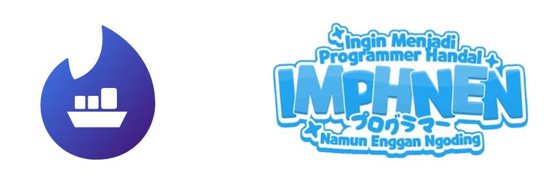

<div align="center">
  

  # ShipPal
  
  [](https://fastapi.tiangolo.com)
  [](https://bun.sh)
  [](https://supabase.com)
  [](https://www.docker.com/)
  [![Strands Agents](https://img.shields.io/badge/AI-Strands_Agents-FF4B4B?style=flat&logo=data:image/svg%2bxml;base64,PHN2ZyB3aWR0aD0iMjkwIiBoZWlnaHQ9IjQ2MyIgdmlld0JveD0iMCAwIDI5MCA0NjMiIGZpbGw9Im5vbmUiIHhtbG5zPSJodHRwOi8vd3d3LnczLm9yZy8yMDAwL3N2ZyI+CjxwYXRoIGQ9Ik05Ny4yOTAyIDUyLjc4ODRDODUuMDY3NCA0OS4xNjY3IDcyLjIyMzQgNTYuMTM4OSA2OC42MDE3IDY4LjM2MTZDNjQuOTgwMSA4MC41ODQzIDcxLjk1MjQgOTMuNDI4MyA4NC4xNzQ5IDk3LjA1MDFMMjM1LjExNyAxMzkuNzc1QzI0NS4yMjMgMTQyLjc2OSAyNDYuMzU3IDE1Ni42MjggMjM2Ljg3NCAxNjEuMjI2TDMyLjU0NiAyNjAuMjkxQy0xNC45NDM5IDI4My4zMTYgLTkuMTYxMDcgMzUyLjc0IDQxLjQ4MzUgMzY3LjU5MUwxODkuNTUxIDQxMS4wMDlMMTkwLjEyNSA0MTEuMTY5QzIwMi4xODMgNDE0LjM3NiAyMTQuNjY1IDQwNy4zOTYgMjE4LjE5NiAzOTUuMzU1QzIyMS43ODQgMzgzLjEyMiAyMTQuNzc0IDM3MC4yOTYgMjAyLjU0MSAzNjYuNzA5TDU0LjQ3MzggMzIzLjI5MUM0NC4zNDQ3IDMyMC4zMjEgNDMuMTg3OSAzMDYuNDM2IDUyLjY4NTcgMzAxLjgzMUwyNTcuMDE0IDIwMi43NjZDMzA0LjQzMiAxNzkuNzc2IDI5OC43NTggMTEwLjQ4MyAyNDguMjMzIDk1LjUxMkw5Ny4yOTAyIDUyLjc4ODRaIiBmaWxsPSIjOTg5ODk4Ii8+CjxwYXRoIGQ9Ik0yNTkuMTQ3IDAuOTgxODEyQzI3MS4zODkgLTIuNTc0OTggMjg0LjE5NyA0LjQ2NTcxIDI4Ny43NTQgMTYuNzA3NEMyOTEuMzExIDI4Ljk0OTIgMjg0LjI3IDQxLjc1NyAyNzIuMDI4IDQ1LjMxMzhMNzEuMTcyNyAxMDMuNjcxQzQwLjcxNDIgMTEyLjUyMSAzNy4xOTc2IDE1NC4yNjIgNjUuNzQ1OSAxNjguMDgzTDI0MS4zNDMgMjUzLjA5MMzAgNy44NzIgMjg1LjMwMiAyOTkuNzk0IDM4Mi41NDYgMjI4Ljg2MiA0MDMuMzM2TDMwLjQwNDEgNDYxLjUwMkMxOC4xNzA3IDQ2NS4wODggNS4zNDcwOCA0NTguMDc4IDEuNzYxNTMgNDQ1Ljg0NEMtMS44MjM5IDQzMy42MTEgNS4xODYzNyA0MjAuNzg3IDE3LjQxOTcgNDE3LjIwMkwyMTUuODc4IDM1OS4wMzVDMjQ2LjI3NyAzNTAuMTI1IDI0OS43MzkgMzA4LjQ0OSAyMjEuMjI2IDI5NC42NDVMNDUuNjI5NyAyMDkuNjM1Qy0yMC45ODM0IDE3Ny4zODYgLTEyLjc3NzIgNzkuOTg5MyA1OC4yOTI4IDU5LjM0MDJMMjU5LjE0NyAwLjk4MTgxMloiIGZpbGw9IiMwMEZGNzciLz4KPC9zdmc+Cg==)](https://strandsagents.com)
  [](LICENSE)


  ### Make Local Go Global.

  Used by forward-thinking SMEs and international buyers to streamline global trade.

</div>

ShipPal is a "Smart Matchmaking" platform connecting local exporters with international buyers. Think of it as **Tinder for B2B Trade** coupled with an AI-powered logistics & legal assistant.

Unlike traditional B2B marketplaces that are static and complex, ShipPal simplifies the export process into a familiar flow: **Post → Swipe → Negotiate → Ship & Pay**.

## Key Features

### 1. The Matchmaking Engine
Traditional directories are cluttered. ShipPal uses a swiping interface (Right for Interest, Left for Pass) to match Buyers and Sellers based on:
- **Product Specifications** (Grade, Origin, Certification)
- **Logistics Compatibility** (MOQ vs. Production Capacity)
- **Destination** (Port-to-Port matching)

### 2. Deal Room & @pal
Once matched, parties enter the **Deal Room**. This isn't just a chat; it's an intelligent workspace:
- **Real-time Translation**: Communicate seamlessly across languages (e.g., Seller speaks Indonesian, Buyer sees English).
- **@pal Assistant**: Mention `@pal` to get instant estimates on shipping costs, HS Code recommendations, or regulatory checks.

### 3. AI Compliance Agentry
The biggest barrier to export is paperwork. ShipPal's AI removes this friction:
- **Auto-Generates Documents**: Automatically creates Commercial Invoices, Packing Lists, and COOs compliant with destination country regulations.
- **Regulatory Guardian**: Alerts users to specific import restrictions or required certifications before the deal is sealed.

## Technology Stack

- **Backend**: Python, FastAPI, Docker, Strands Agents
- **Frontend**: Next.js (React), Tailwind CSS, Bun
- **Database**: Supabase (PostgreSQL)

## Quickstart

### Frontend 

```bash
cd shippal-frontend
bun install
bun dev
```

### Backend 

```bash
cd shippal-backend
poetry install
poetry run poe dev
```

### Docker

```bash
cd shippal-backend
docker build -t shippal-backend .
docker run -p 8000:8000 shippal-backend
```

## License

Distributed under the MIT License. See [`LICENSE`](LICENSE) for more information.

<br />

<div align="center">
  <i>ShipPal: Make Local Go Global.</i>
</div>
